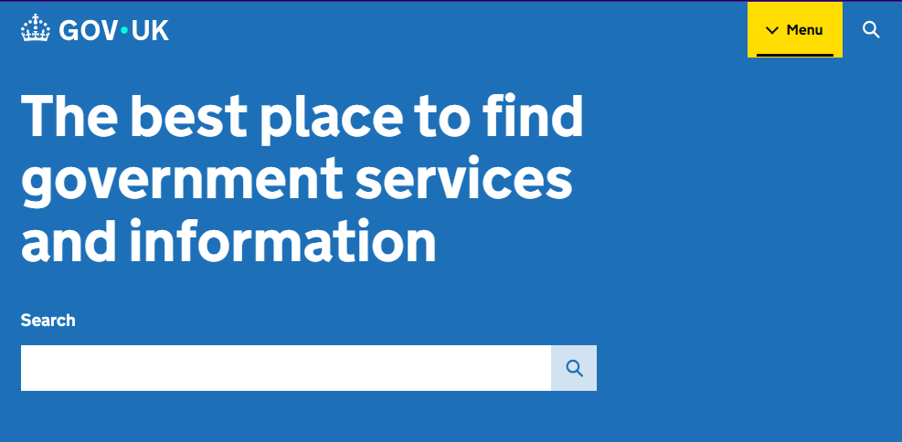
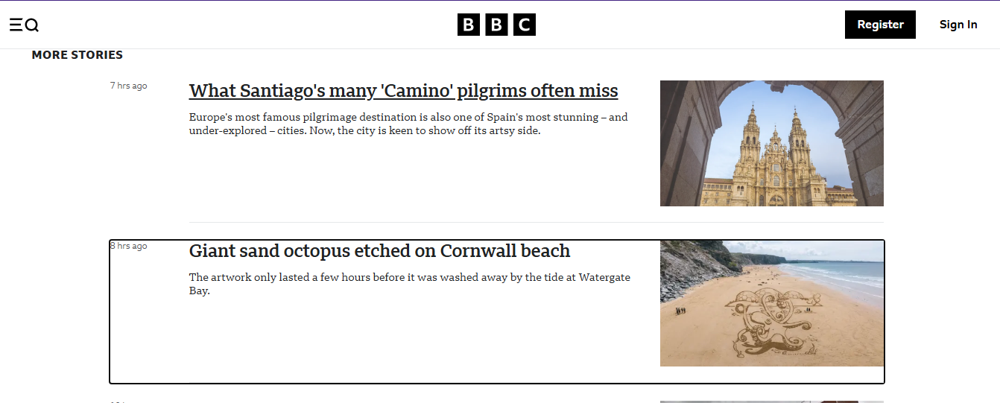

 Acessibilidade na Web: `tabindex`, `:focus` e `outline`

## O que é acessibilidade na web
A acessibilidade na web refere-se ao desenvolvimento de sites, aplicações e conteúdos digitais que possam ser utilizados por todas as pessoas, inclusive aquelas com deficiências. Isso inclui garantir que usuários com mobilidade reduzida, deficiência visual, auditiva ou cognitiva possam navegar, interagir e compreender o conteúdo digital de forma autônoma.  

 O suporte à navegação por teclado remonta às primeiras iniciativas de acessibilidade digital nos anos 1990, com o surgimento das Diretrizes de Acessibilidade para Conteúdo Web (WCAG) do World Wide Web Consortium (W3C) principal organização de padronização da World Wide Web. Desde então, tornou-se um requisito central garantir que interfaces sejam utilizáveis por pessoas com limitações, colocando a navegação por teclado como pilar da operabilidade.

 Muitos usuários não utilizam mouse para navegar na web. Pessoas com deficiência motora, usuários de leitores de tela e até mesmo usuários avançados preferem usar o teclado para navegar. Por isso, garantir uma navegação eficaz e previsível usando apenas o teclado é essencial para tornar uma interface acessível.

 Este trabalho aborda três dos principais funcionalidades para garantir uma navegação por teclado eficaz: 
 * O atributo **HTML** [`tabindex`](#o-atributo-tabindex)  
 * O seletor **CSS** [`:focus`](#o-seletor-css-focus) 
 * A propriedade [`outline`](#a-propriedade-outline)

 ## O atributo `tabindex`
 *O que é e para que serve o **tabindex***
 
 O `tabindex` é um atributo HTML que define se e em qual ordem um elemento pode receber foco ao navegar com o teclado. Ele é essencial para incluir elementos personalizados. Por padrão, os navegadores permitem que elementos como **links**, **botões** e **campos de formulário** recebam foco usando a tecla `Tab`. Esse comportamento padrão respeita a ordem do Document Object Model (DOM).
### Valores possíveis do `tabindex`
* `tabindex="0"` – Inclusão na ordem natural
    * O elemento recebe o foco seguindo a ordem natural do DOM.
    ```html
    <div tabindex="0">
        Elemento focável
    </div>

* `tabindex="-1"` – Foco programático
    * O elemento não  recebe o foco com `Tab`, mas pode receber foco via JavaScript, usando `element.focus()`.
    
    ```html
        <div tabindex="-1" 
            id="card" 
            style="border: 2px solid #4A90E2; padding: 10px; outline:none;">
            Conteúdo do card
        </div>

        <script>
            document.getElementById('card').focus();
        </script>
* `tabindex="1"` ou maior – Ordem personalizada
    * Elementos com valores maiores são **focados antes** dos elementos com `tabindex="0"` ou seja, ele irá focar sempre em ordem decrescente. Isso normalmente causa problemas de usabilidade e deve ser evitado, pois quebra a sequência natural da página.
     ```html
        <button tabindex="2">Botão com tabindex=2 (focado primeiro)</button>
        <button tabindex="1">Botão com tabindex=1 (focado segundo)</button>
        <button tabindex="0">Botão com tabindex=0 (focado por último)</button>  
### Boas práticas no uso de `tabindex`
- Usar `tabindex="0"` para elementos customizados (como botões em `divs`).
- Usar `tabindex="-1"` para permitir foco programático em elementos como modais.
- Evitar valores positivos, pois complicam a ordem de navegação.
- Revisar a estrutura do DOM e evitar a criação de armadilhas de foco.


## O seletor CSS `:focus`
 *O que é e para que serve o seletor **:focus***

O foco é a indicação de qual elemento da interface está ativo e pronto para interação via teclado. Por exemplo, ao pressionar `Tab`, o foco passa de um campo de formulário para outro. Sendo um seletor CSS aplica estilos a elementos que estão no estado de foco, ou seja, que foram ativados por navegação através do teclado ou clique.

O foco precisa ser visualmente evidente uma vez que  usuários com deficiência visual ou cognitiva dependem de pistas visuais para saber onde estão na interface.
Tornando assim imprescindivel uma estilização correta do `:focus`, para garantir que os usuários se localizem na navegação.

Exemplo
```css
button:focus {
  outline: 3px solid #005fcc;
  background-color: #e5f1ff;
}
```

### Combinação com `:focus-visible`
`:focus-visible` aplica estilos apenas quando o foco é visível via teclado (não via mouse), evitando efeitos visuais desnecessários em interações com clique.

Exemplo: 
```html
<style>
  button:focus-visible {
    outline: 3px solid #4A90E2; /
  }
</style>

<button>Botão acessível</button>
```
## A propriedade `outline`
*O que é `outline` e para que serve`*

A maioria dos navegadores usa `outline` para mostrar foco em botões, links e campos. Remover essa indicação sem substituição compromete a acessibilidade. Mas afinal, o que é o `outline`.

O `outline` é uma linha que aparece ao redor de um elemento, mas não afeta o layout como `border`. Ela é usada por padrão para indicar foco. Remover `outline` sem fornecer uma alternativa visual dificulta ou impossibilita a navegação por teclado. Isso é uma violação das diretrizes WCAG. Se for necessário remover o  `outline`, é interressante forneçer um substituto visual equivalente com `box-shadow`, `border` ou outros estilos perceptíveis. Para isso, usar contrastes fortes, cores perceptíveis e indicadores visuais consistentes com o restante do layout para indicar foco ajuda a deixa a aplicação mais acessível sem perder o design projetado.

Exemplo **RUIM**:
```html
<style>
  button:focus {
    outline: none;
  }
</style>

<button>Continuar</button>
```
Exemplo **ACESSíVEL**
```html
<style>
  button:focus {
    outline: none;
    box-shadow: 0 0 0 3px #FFA500; 
    }
</style>

<button>Continuar</button>
```

## Erros Comuns
* Remover `outline` sem substituição
    * Oculta o estado de foco para usuários que usam teclado se tornando confuso a navagação.
* Uso excessivo de `tabindex` positivo
    * Quebra a ordem natural e torna a navegação imprevisível.
* Falta de foco visível
    * Mesmo que o foco exista no código, se ele não for visualmente percebido, o usuário fica perdido.

## Boas Práticas e Diretrizes
> **Diretrizes WCAG - 2.1.1 Teclado**
> 
> > *Toda a funcionalidade do conteúdo é operável através de uma interface de teclado sem requerer temporizações específicas para digitação individual, exceto quando a função subjacente requer entrada de dados que dependa da cadeia de movimento do usuário e não apenas dos pontos finais.*

> **Diretrizes WCAG - 2.4.7 Foco Vísivel**
> 
> > *Qualquer interface de usuário operável por teclado dispõe de um modo de operação onde o indicador de foco do teclado está visível.*

Essas diretrizes do WCAG exigem que todo o conteúdo seja navegavel por teclado, como citado acima. Além de salientar a importância de testes com pessoas que possuem deficiência, pois as mesmas revelam problemas não previsto em testes automatizados. Também ajudam a validar decisões de design.

### Principais diretrizes para navegação e foco
- Priorizar e preservar a ordem natural do DOM
- Garantir que cada iteração seja acessível por teclado
- Evitar armadilhas de foco

### Ferramentas para teste de foco e teclado
- Axe-core
- Lighthouse
- Accessibility Insights

## Estudo de Caso
Esses são exemplos de dois sites em que a acessibilidade através do `tabindex`, `:focus`, `outline` foram bem desenvolvidas, tornando a navagação acessível para o público que utiliza o teclado para acessar o site.

### [GOV.UK](https://www.gov.uk/) 

* Navegação por teclado exemplar
* Destaque para visibilidade do foco
* Ordem lógica e previsível com `tabindex="0"`

### [BBC](https://www.bbc.com)

* Personalização acessível de foco
* Uso de `:focus-visible` com design consistente
* Compatibilidade com navegação móvel e por teclado

## Conclusão
A acessibilidade web é um tema que precisa cada vez mais ser abordado, principalmente quando falamos no âmbito dos dispositivos móveis que não possuem o `Tab`, mais ainda usam foco para navegação por leitores de tela. O mundo do desenvovledor front-end é enorme, bem como os recursos nativos e samânticos do HTML, sendo assim os elementos devem ser semanticamente corretos e interativos, facilitando a navegação. 
Elementos como menus, modais, tooltips  corrosséis devem ser navegáveis com `Tab` e `Esc` garantindo assim uma melhor navegabilidade. 
Conclui-se que todas as ferramentas que foram citadas nesse trabalho são poderosas e essenciais para a navegação por taclado, devendo ser utilizadas com cuidado visando uma interface acessível para todos.  

## Aplicação
[Apresentação de slides](https://www.bbc.comhttps://prezi.com/p/lbc0vz0u3r6a/?present=1)

[Aplicação no GIT HUB](https://mirioliveirafernandes.github.io/pc-spike-accessibility/)


## Referências e Leituras Complementares
- [Yale Usability: Focus & Keyboard Operability](https://usability.yale.edu/web-accessibility/articles/focus-keyboard-operability)
- [Web.dev: Control Focus with tabindex](https://web.dev/articles/control-focus-with-tabindex?hl=pt-br)
- [MDN: Accessibility Keyboard Guide](https://developer.mozilla.org/en-US/docs/Web/Accessibility/Guides/Understanding_WCAG/Keyboard)
- [The Admin Bar: Focus Outlines](https://theadminbar.com/accessibility-weekly/focus-outlines/)
- [MDN: Accessibility and Mobile Web](https://developer.mozilla.org/en-US/docs/Learn_web_development/Core/Accessibility/Mobile)
- [W3C: Mobile Accessibility Guidelines](https://www.w3.org/WAI/standards-guidelines/mobile/)
- [W3C – Acessibilidade via Teclado (WCAG 2.1)](https://www.w3c.br/traducoes/wcag/wcag21-pt-BR/#keyboard-accessible)

## Checklist da Entrega

- ✅ Pesquisa realizada (Spike)
- ✅ Markdown com conteúdo autoral (.md)
- ✅Código funcional incluso e explicado
- ✅ Fontes confiáveis citadas
- ✅ Slides criados para apresentação
- ✅ Repositório no GitHub com a PoC

